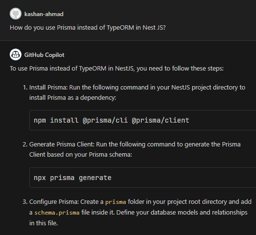
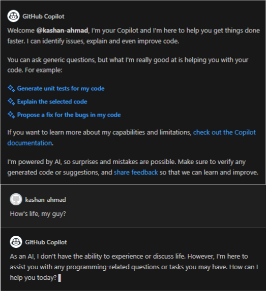

Pretty sure all of you have heard of GitHub’s Copilot by now, many seasoned developers had adopted it back when it was just an early access project while many still don’t see a reason why it’s even a thing. But, lemme tell you something, not using Copilot in 2024, even back in early 2023, is a no-brainer, no offense. With the recent updates in Copilot, my guy has become the only tool you need to learn anything you can learn inside VS Code.

Just to elaborate on the seriousness of the situation, I was able to learn Nest JS within 2 days, well, most of it, without ever leaving VS Code. Back in the day, all Copilot did was land some suggestions and was good for boilerplate stuff, now? Now my guy has a whole chat built-in and keeps an eye on your whole project, knows what your naming conventions are and how you write code, and acts accordingly.

That’s just the beginning, Copilot can write your test cases for you without you ever leaving VS Code, spin up whole migrations and schemas without you ever leaving the little chat box, and completely replace you in the coming years in case you don’t replace yourself with a better you. Now, I wouldn’t be stoked and excited enough if Copilot lacked internet access. But it doesn’t, The dude can read documentation from the web and tell you what’s there to behold. Poof, Magic 🤯

That being said, it’s sad to see how most of the senior-most engineers, those who still think PHP is relevant, do not see any value in Copilot. One fairly round argument against Copilot is that it suggests everything and takes away the joy of learning. Well, my guy, you can always just disable suggestions by the click of a button. I always disable suggestions when I’m learning something new. For instance, my Copilot wasn’t suggesting anything, only answering my questions, during the 2 days I spent learning Nest JS.

Another really strong argument was that GitHub was using code from private repos to train Copilot, which was true, and it did bring a lot of backlash. GitHub was fast to reconcile and now every suggestion in Copilot contains a reference to the licenses. If you weigh the pros and cons, Copilot is the only tool you need right now to learn anything you can from within VS Code.

You do not need to watch an hour-long YouTube tutorial anymore, nor read 20-minute-long blog posts from “defluencers” (Developer Influencers, dudes who spend 4 hours a day writing blog posts and competing for upvotes) on how to use some niche tooling, you can simply ask Copilot from within VS Code and you have everything at your disposal.

2023 was wild, 2024 is going to be wilder. AI isn’t holding back and only time will tell what exactly we’re heading into. Until then, keep learning new things, keep getting better, and remember, AI will not replace those who replace themselves with a better version of themselves every day.
