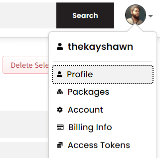
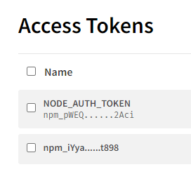
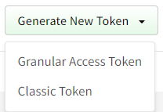
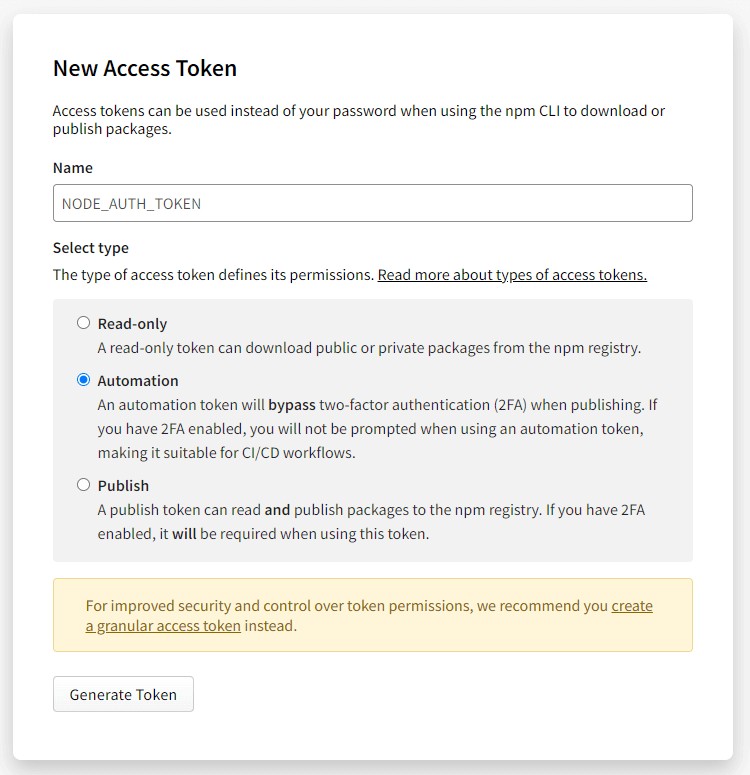
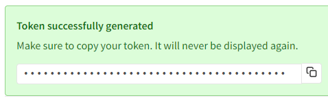
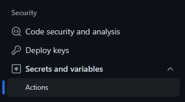
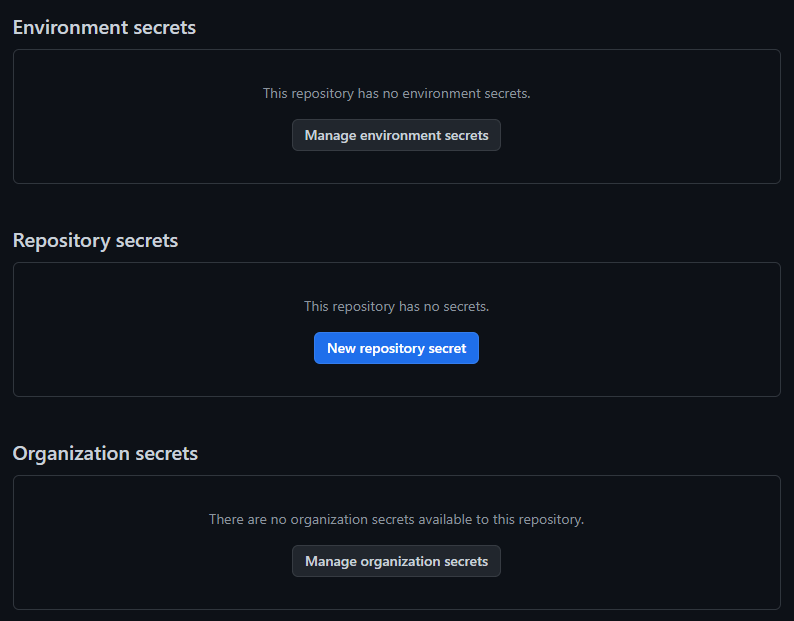
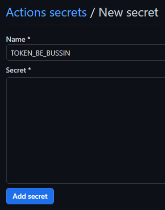

This is more like a note to self than a blog post, but I'm sure it'll help someone out there. So, I was working on this sweet little JS Library boilerplate called [Crust](https://github.com/sassywares/crust) and I wanted to create a release on GitHub whenever I push a git tag as well as build and publish the package to NPM. Here's how I got it done.

Firstly, I created a workflow file in `.github/workflows` and named it `release.yml`. Then, I added the following code to it.

```yml
name: Crusty

on:
  push:
    tags:
      - "*"

jobs:
  create-release:
    runs-on: ubuntu-latest
    steps:
      - uses: actions/checkout@v3
      - uses: actions/setup-node@v3
        with:
          node-version: 18
          registry-url: https://registry.npmjs.org/
      - uses: actions/create-release@v1
        env:
          GITHUB_TOKEN: ${{ secrets.GITHUB_TOKEN }}
        with:
          tag_name: ${{ github.ref }}
          release_name: Crust@v${{ github.ref }}
          draft: false
          prerelease: false

  publish-to-npm:
    runs-on: ubuntu-latest
    steps:
      - uses: actions/checkout@v3
      - uses: actions/setup-node@v3
        with:
          node-version: 18
          registry-url: https://registry.npmjs.org/
      # Install deps
      - run: npm i

      # Prepare release
      - run: npm run release.prepare

      # Publish to NPM
      - run: npm run release.publish
        env:
          # This is the NPM token used to publish the package to NPM, you only need this if you've enabled publishing with access tokens. Read more about this [here](https://docs.npmjs.com/about-access-tokens). Once you have the token in NPM, you'll have to add it as a secret in the GitHub repository. Read more about GitHub secrets [here](https://docs.github.com/en/actions/reference/encrypted-secrets).
          NODE_AUTH_TOKEN: ${{ secrets.NODE_AUTH_TOKEN }}
```

## Meta Data

Let's setup some meta data first. The following line is the name of the workflow, you can name it whatever you want, but a convention is to name it after the repository prefixed with the name of the event that triggers the workflow. In this case, the event is a release event, so I named it `Release crust`.

```yml
name: Release crust
```

Onwards, we need to specify when to trigger a workflow. The following line watches for a new git tag to be pushed and then triggers the workflow. You can read more about it [here](https://docs.github.com/en/actions/reference/events-that-trigger-workflows#push). The `*` means that it'll trigger on any tag push. Say you wanna trigger the workflow only on a tag push that starts with `v`, you can replace the `*` with `v*`.

```yml
on:
  push:
    tags:
      - "*"
```

You can also trigger a workflow on a pull request, a push to a branch, or just about anything. You can read more about it [here](https://docs.github.com/en/actions/reference/events-that-trigger-workflows).

## Jobs

Next, we need to specify the jobs that we want to run when the workflow is triggered. In this case, we want to create a release on GitHub and publish the package to NPM. So, we'll create two jobs.

```yml
jobs:
  create-release:
  publish-to-npm:
```

### Create Release

This is the first job that creates a release on GitHub.

```yml
create-release:
  runs-on: ubuntu-latest
    steps:
      - uses: actions/checkout@v3
      - uses: actions/setup-node@v3
        with:
          node-version: 18
          registry-url: https://registry.npmjs.org/
      - uses: actions/create-release@v1
        env:
          GITHUB_TOKEN: ${{ secrets.GITHUB_TOKEN }}
        with:
          tag_name: ${{ github.ref }}
          release_name: crust@v${{ github.ref }}
          draft: false
          prerelease: false
```

Most of this is just what the docs say, the only thing you need to care about is the `release_name`. The `release_name` is the name of the release that'll be created on GitHub, a convention is to name it as `repository@version`. In our case, the tag that triggered the workflow is the version, so we'll use that, prefixed with a `v` just to make it look smexy. Note that the variable `github.ref` contains the tag that triggered the workflow, you can use it wherever you need the tag.

### Publish to NPM

This is the second job that builds and publishes the package to NPM.

```yml
publish-to-npm:
  runs-on: ubuntu-latest
  steps:
    - uses: actions/checkout@v3
    - uses: actions/setup-node@v3
      with:
        node-version: 18
        registry-url: https://registry.npmjs.org/
    # Install deps
    - run: npm i

    # Prepare release
    - run: npm run release.prepare

    # Publish to NPM
    - run: npm run release.publish
      env:
        NODE_AUTH_TOKEN: ${{ secrets.NODE_AUTH_TOKEN }}
```

Most of this, as expected, is boilerplate I copied from the docs, take care about the. The `node-version` is the version of Node.js you want to use to run the job, this depends on which version you used for your app, crust used Node 18 at the time it was created so 18 is the specified version. The steps prefixed with `run` are the actual commands you need to install the dependencies, build the package, and publish it to NPM. The `env` section is where you specify the environment variables you need to run the commands. If you need secret env variables, keep on reading.

When you publish to NPM from a CI/CD pipeline, you'll need to specify a `NODE_AUTH_TOKEN`. This is just basic authentication stuff, see the links below if you wanna go in depth. Here's what you need to do to get it working.

1. Go click your gravatar on the top right corner of the NPM website and click on `Access Tokens`.



2. You'll see a default token just laying there, forget about it and click on `Create New Token`.



3. Choose the `classic token`, granular tokens are for more advanced stuff.



4. Give it a name, you should name it based on where you're gonna use it, don't follow my example, I was just testing it out. Once done, choose the `Automation` option from the 3, this allows you to use your token in CI/CD pipelines, and click `Generate Token`.



5. You'll get redirected to the token listing and your new token will be displayed atop, copy it and don't close your tab just yet, might need to copy again.



6. Go to your GitHub repository and click on `Settings` and then `Secrets` and then `Actions` from the left sidebar.



7. We're gonna generate a repository secret, so click on `New repository secret`.



8. Name it as you please, `NODE_AUTH_TOKEN` is a good choice, then paste the token you copied from NPM in the `Value` field. Click `Add secret` and you're done.



9. Now, make sure the name you gave to the secret matches the name you used in the workflow file, in this case, it's `NODE_AUTH_TOKEN`. If you named it something else, change it accordingly.

And that's about it, you're done. Now, whenever you push a tag to your repository, the workflow will trigger and create a release on GitHub and publish the package to NPM.

- [GitHub Secrets](https://docs.github.com/en/actions/reference/encrypted-secrets)
- [NPM Access Tokens](https://docs.npmjs.com/about-access-tokens)

Yeah, I know, I love you too ❤. Until next time, keep solving problems, keep getting better, and keep moving forward.

- [Crust](https://github.com/sassywares/crust)
- [Sassywares](https://sassywares.com/)
- [Yours Truly](https://kashanahmad.me/)
