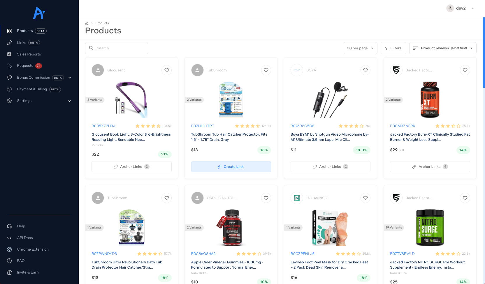

**Company:** Archer Affiliates (NYC-based Startup)  
**Role:** Lead Frontend Engineer  
**Project Type:** Complete Platform Redesign & Chrome Extension  
**Market:** Amazon Affiliates Marketing

---

## Project Overview

Archer Affiliates is an Amazon affiliates platform that helps marketers manage and optimize their affiliate campaigns. I joined as lead frontend engineer to tackle a critical challenge: the platform was out of sync, off-brand, and inconsistent, a patchwork of pages built without cohesive design or user experience strategy.

The transformation required redesigning the entire platform page by page while maintaining backward compatibility, as old and new pages had to coexist during the multi-month migration. This challenge led to innovative solutions like compatibility components ("SidebarCompat") that bridged legacy and modern codebases.



---

## Key Achievements

**Business Impact**

- **50% increase in sales** following UI/UX redesign
- Elevated to CEO's inner circle due to impact
- Offered Product Manager role (declined due to commitments)
- Built hiring pipeline, recruited 4 team members who integrated successfully

**Technical Leadership**

- Led complete platform redesign with Material UI
- Architected backward-compatible migration strategy
- Expanded to full-stack role (FastAPI backend, SendGrid integration)
- Built Chrome extension with shared codebase (Plasmo + React)
- Extracted design system and Intercom SDK into reusable NPM packages

**Team Building**

- Recruited 2 engineers, 1 QA, 1 project manager from personal network
- 3/4 still employed after 1+ year (75% retention)
- Established technical hiring standards

---

## Tech Stack

### Frontend Framework

- **Next.js** - React framework
- **React** - Component architecture
- **TypeScript** - Type-safe development
- **Material UI (MUI)** - Design system foundation

### Backend Integration

- **FastAPI** - Python backend framework
- **SendGrid** - Email delivery service
- **Custom email templates** - Transactional emails

### Chrome Extension

- **Plasmo** - React-based extension framework
- **Shared NPM packages** - Design system + Intercom SDK
- **Unified codebase** - Same components across web + extension

### Ticketing System

- **Intercom** - Customer support platform
- **Custom SDK** - Wrapper for Intercom API
- **Admin panel integration** - Ticket review and response system

### Code Sharing

- **NPM private packages** - Monorepo-style code sharing
- **Design system package** - Shared UI components
- **Intercom SDK package** - Shared business logic

---

## The Redesign Challenge

### Initial State: "Out of Sync, Out of Brand, Out of Shape"

**Problems Identified:**

**Visual Inconsistency**

- Different color schemes across pages
- Inconsistent typography (sizes, weights, fonts)
- Mismatched spacing and layouts
- No cohesive design language

**UX Fragmentation**

- Navigation patterns varied by section
- Forms with different validation approaches
- Inconsistent button styles and interactions
- Confusing user flows

**Technical Debt**

- Pages built by different developers at different times
- No component library or shared patterns
- Duplicate code everywhere
- Hard to maintain or extend

**Business Impact:**

- Users confused by inconsistent experience
- High support ticket volume
- Lower conversion rates
- Poor brand perception

### The Migration Strategy: Backward Compatibility

**Challenge:** Can't take platform offline for complete rewrite. New and old pages must coexist during multi-month transition.

**Constraints:**

- Users actively using platform during redesign
- Can't break existing functionality
- Some pages updated monthly, others quarterly
- Feature development can't stop

**Solution: Page-by-Page Migration with Compatibility Layer**

```
archer-platform/
├── components/
│   ├── modern/                  # New design system
│   │   ├── Sidebar/
│   │   ├── Header/
│   │   ├── Button/
│   │   └── ...
│   ├── compat/                  # Compatibility components
│   │   ├── SidebarCompat/       # Works with legacy pages
│   │   ├── HeaderCompat/        # Bridges old/new
│   │   └── ...
│   └── legacy/                  # Original components (deprecated)
│       └── ...
├── pages/
│   ├── dashboard/               # ✅ Redesigned
│   ├── campaigns/               # ✅ Redesigned
│   ├── analytics/               # 🚧 In progress
│   └── settings/                # ⏳ Legacy (pending)
```

**Compatibility Component Pattern:**

```typescript
// SidebarCompat: Works with both legacy and modern routing
interface SidebarCompatProps {
  mode?: "legacy" | "modern";
  routes: Route[];
  onNavigate?: (path: string) => void; // For legacy callback-based nav
}

export function SidebarCompat({
  mode = "modern",
  routes,
  onNavigate,
}: SidebarCompatProps) {
  const router = useRouter(); // Modern Next.js routing

  const handleNavigation = (path: string) => {
    if (mode === "legacy" && onNavigate) {
      onNavigate(path); // Call legacy callback
    } else {
      router.push(path); // Use modern routing
    }
  };

  return <Sidebar routes={routes} onNavigate={handleNavigation} />;
}
```

**Migration Process:**

1. **Design System Establishment**

   - Defined Material UI theme
   - Created component library
   - Documented patterns in Storybook

2. **Page Prioritization**

   - Identified high-traffic pages first
   - Redesigned user-facing pages before admin
   - Tackled complex pages with engineering support

3. **Incremental Rollout**

   - Deploy redesigned pages alongside legacy
   - Monitor analytics for each page
   - Gather user feedback before next migration
   - Gradually deprecate compatibility components

4. **Legacy Cleanup**
   - Once all pages migrated, remove compat layer
   - Delete legacy components
   - Optimize bundle size

**Result:**

- Zero downtime during multi-month redesign
- Users experienced gradual, non-disruptive improvements
- Development velocity maintained
- Clean codebase at end of migration

---

## Material UI Design System

### Why Material UI?

**Advantages:**

- Battle-tested component library
- Accessibility built-in
- Theming system for brand consistency
- Large community and documentation
- TypeScript support

**Customization:**

```typescript
// Custom Archer theme
const archerTheme = createTheme({
  palette: {
    primary: {
      main: "#1A73E8", // Archer blue
    },
    secondary: {
      main: "#34A853", // Success green
    },
  },
  typography: {
    fontFamily: '"Inter", "Helvetica", "Arial", sans-serif',
    h1: {
      fontSize: "2.5rem",
      fontWeight: 600,
    },
    // ... custom typography scale
  },
  components: {
    MuiButton: {
      styleOverrides: {
        root: {
          borderRadius: 8,
          textTransform: "none",
          fontWeight: 500,
        },
      },
    },
    // ... custom component overrides
  },
});
```

### Component Library Structure

```
@archer/ui (NPM package)
├── components/
│   ├── Button/
│   ├── Card/
│   ├── DataTable/
│   ├── Sidebar/
│   ├── Header/
│   ├── Modal/
│   ├── Form/
│   │   ├── TextInput/
│   │   ├── Select/
│   │   ├── DatePicker/
│   │   └── ...
│   └── ...
├── theme/
│   ├── theme.ts
│   ├── colors.ts
│   └── typography.ts
└── index.ts
```

**Key Components Built:**

- Affiliate dashboard cards
- Campaign management tables
- Analytics charts and graphs
- Commission tracking displays
- Product search and filters
- Performance metrics widgets

---

## Ticketing System Integration

### Challenge

Support requests scattered across:

- Email
- Contact forms (no tracking)
- Help pages (no way to respond)
- Direct messages

**Result:** Lost tickets, slow response times, frustrated users.

### Solution: Intercom Integration

**Implementation:**

**1. Custom Intercom SDK**

```typescript
// @archer/intercom (NPM package)
export class ArcherIntercom {
  private intercom: IntercomClient;

  initialize(appId: string, userHash?: string) {
    // Initialize Intercom widget
  }

  openTicket(metadata?: TicketMetadata) {
    // Open support widget with context
  }

  updateUser(userData: UserData) {
    // Sync user data to Intercom
  }

  trackEvent(eventName: string, metadata?: object) {
    // Track user actions for support context
  }
}
```

**2. Integration Points**

**Contact Forms**

- User submits form → Creates Intercom ticket automatically
- Pre-fills user context (name, email, account details)
- Attaches relevant metadata (page, error logs)

**Help & Support Pages**

- "Contact Support" button → Opens Intercom widget
- Context automatically included (current page, user tier)
- Previous tickets visible to user

**In-App Support Widget**

- Available on all pages (bottom-right)
- Badge shows unread messages
- Real-time notifications

**3. Admin Panel**

**Ticket Dashboard**

- View all tickets by status (open, pending, resolved)
- Filter by priority, category, user tier
- Assign tickets to team members
- Response time tracking

**Ticket Detail View**

- Full conversation history
- User context sidebar (account info, usage stats)
- Quick actions (assign, close, escalate)
- Internal notes (not visible to user)

**Analytics**

- Response time metrics
- Resolution time by category
- Common issues dashboard
- User satisfaction scores

**Result:**

- Centralized support workflow
- Faster response times
- Better user satisfaction
- Support team efficiency increased

---

## Full-Stack Expansion: Backend Integration

### Context

Initially hired as frontend engineer, but backend became bottleneck for feature shipping.

**Backend Team Challenges:**

- Small team (2 backend engineers)
- Email integration complex (SendGrid API, template management)
- Frontend waiting on API endpoints

### My Transition to Full-Stack

**What I Did:**

**1. FastAPI Email Integration**

```python
# Email service endpoints
from fastapi import APIRouter, Depends
from sendgrid import SendGridAPIClient
from sendgrid.helpers.mail import Mail

router = APIRouter()

@router.post("/emails/send")
async def send_email(
    recipient: str,
    template_id: str,
    dynamic_data: dict,
    current_user: User = Depends(get_current_user)
):
    # Send templated email via SendGrid
    message = Mail(
        from_email='noreply@archer.com',
        to_emails=recipient
    )
    message.template_id = template_id
    message.dynamic_template_data = dynamic_data

    sg = SendGridAPIClient(settings.SENDGRID_API_KEY)
    response = sg.send(message)

    return {"status": "sent", "message_id": response.message_id}
```

**2. SendGrid Template Management**

- Created transactional email templates in SendGrid UI
- Welcome emails
- Password reset emails
- Commission payout notifications
- Campaign performance reports
- Support ticket confirmations

**3. API Development While Backend Focused Elsewhere**

- Built email-related endpoints myself
- Backend engineers could focus on core affiliate logic
- Reduced handoff delays

**Skills Acquired:**

- Python/FastAPI fundamentals
- SendGrid API integration
- Email deliverability best practices
- API design and documentation
- Database queries (SQLAlchemy)

**Result:**

- Unblocked frontend development
- Faster feature shipping
- Better understanding of full system
- More valuable to organization

---

## Chrome Extension: Shared Codebase Architecture

### The Challenge

**Requirement:** Build Chrome extension for Archer with:

- Same design as web platform
- Intercom support widget
- Consistent user experience

**Problem:** Chrome extensions are separate codebases by default. How to avoid duplicating UI and logic?

### Solution: NPM Package Extraction

**Architecture:**

```
archer-monorepo/
├── packages/
│   ├── @archer/ui/              # Shared design system
│   │   ├── components/
│   │   ├── theme/
│   │   └── package.json
│   ├── @archer/intercom/        # Shared Intercom SDK
│   │   ├── sdk/
│   │   ├── types/
│   │   └── package.json
│   └── @archer/shared-logic/    # Shared business logic
│       ├── utils/
│       ├── hooks/
│       └── package.json
├── apps/
│   ├── web/                     # Next.js web platform
│   │   ├── package.json         # Depends on @archer/*
│   │   └── ...
│   └── extension/               # Plasmo Chrome extension
│       ├── package.json         # Depends on @archer/*
│       └── ...
```

**Package Dependencies:**

```json
// apps/web/package.json
{
  "dependencies": {
    "@archer/ui": "workspace:*",
    "@archer/intercom": "workspace:*",
    "@archer/shared-logic": "workspace:*"
  }
}

// apps/extension/package.json
{
  "dependencies": {
    "@archer/ui": "workspace:*",
    "@archer/intercom": "workspace:*",
    "@archer/shared-logic": "workspace:*"
  }
}
```

### Why Plasmo?

**Advantages:**

- React support out of the box
- Hot module reloading
- TypeScript support
- Modern build system (Parcel-based)
- Easy manifest configuration

**Same Components, Different Contexts:**

```typescript
// Shared Button component used in both web and extension
import { Button } from "@archer/ui";

// Web platform usage
function DashboardPage() {
  return <Button onClick={handleClick}>View Campaign</Button>;
}

// Chrome extension usage
function ExtensionPopup() {
  return <Button onClick={handleClick}>View Campaign</Button>;
}
```

**Intercom Integration:**

```typescript
// Shared Intercom SDK works in both contexts
import { ArcherIntercom } from "@archer/intercom";

// Initialize in web
useEffect(() => {
  ArcherIntercom.initialize(INTERCOM_APP_ID, userHash);
}, []);

// Initialize in extension (same API)
useEffect(() => {
  ArcherIntercom.initialize(INTERCOM_APP_ID, userHash);
}, []);
```

### Chrome Extension Features

**Core Functionality:**

- Quick access to affiliate links
- Product search from any Amazon page
- Commission calculator
- Performance dashboard
- Support widget (via shared Intercom SDK)

**Technical Implementation:**

- Content scripts for Amazon page integration
- Background service worker for API calls
- Popup UI using shared design system
- Sync with web platform (shared state)

**Result:**

- **Exact same UX** between web and extension
- Zero code duplication for UI components
- Consistent Intercom support experience
- Single source of truth for business logic
- Fast development (reused existing components)

---

## Team Building & Recruitment

### The Hiring Pipeline

**Context:** Archer needed to scale. CEO trusted my technical judgment and network.

**My Approach:**

1. Identified skills gaps in team
2. Looked into personal network
3. Pitched candidates I'd worked with or knew personally
4. Conducted technical interviews
5. Made hiring recommendations

**Hires Through My Network:**

**2 Engineers**

- Frontend engineer (React/TypeScript)
- Full-stack engineer (Next.js + Python)
- Both still employed 1+ year later

**1 QA Engineer**

- Automated testing specialist
- Set up Playwright test suite
- Still employed 1+ year later

**1 Project Manager**

- Organized sprint planning
- Improved communication between teams
- Left after 6 months (not technical fit)

**Retention Rate:** 75% (3/4 still employed after 1+ year)

**Why This Worked:**

- Pre-vetted candidates (knew their work quality)
- Cultural fit ensured (worked with them before)
- Fast hiring process (trusted referrals)
- Lower risk than cold candidates

**Impact:**

- Engineering team grew from 3 to 7
- Faster feature velocity
- Better code quality (QA improvements)
- Reduced CEO's hiring burden

---

## Results & Business Impact

### Sales Impact

- **50% increase in sales** following redesign
- Improved conversion rates across funnel
- Lower bounce rates on key pages
- Higher user engagement metrics

### User Experience

- Consistent brand experience across platform
- Reduced support tickets related to UI confusion
- Positive user feedback on redesign
- Seamless web-to-extension experience

### Technical Improvements

- Maintainable, consistent codebase
- Reusable component library
- Faster feature development
- Chrome extension shipped in weeks (not months)

### Organizational Impact

- Elevated to CEO's inner circle
- Offered Product Manager role
- Built successful hiring pipeline
- Expanded to full-stack responsibilities

---

## Key Learnings

### Backward Compatibility Strategies

**Lesson:** Major redesigns don't require "big bang" rewrites.

**Page-by-page migration with compatibility layer:**

- Reduced risk (isolate failures to single pages)
- Maintained business continuity
- Allowed iterative improvements
- Enabled data-driven decisions (A/B test old vs new)

**Compat components pattern:**

- Bridge legacy and modern systems
- Technical debt management strategy
- Clear migration path

### Code Sharing via NPM Packages

**Lesson:** Extracting shared code into packages prevents duplication and ensures consistency.

**Benefits:**

- Single source of truth
- Exact same UX across platforms
- Faster development (reuse components)
- Easier maintenance (fix once, deploy everywhere)

**When to extract:**

- Multiple apps need same code
- UI consistency critical
- Team large enough to maintain packages

### Full-Stack Versatility

**Lesson:** Frontend engineers can unblock themselves by learning backend.

**My path:**

- Started pure frontend
- Backend became bottleneck
- Learned FastAPI + SendGrid
- Built APIs myself when needed

**Impact:**

- Faster shipping
- Better system understanding
- More valuable to organization
- Reduced dependencies on others

### Recruitment from Network

**Lesson:** Personal referrals have higher success rate than cold hiring.

**Why 75% retention:**

- Pre-vetted technical skills
- Known work ethic
- Cultural fit understood
- Mutual trust established

**Risk:**

- Network limits diversity
- Must still conduct proper interviews
- Can't rely solely on referrals long-term

### Design Systems Accelerate Development

**Lesson:** Investment in design system pays off quickly at scale.

**Material UI choice:**

- Faster than building from scratch
- Mature, battle-tested components
- Theming enabled brand consistency
- Accessibility built-in

**Custom vs Framework:**

- Use framework when possible
- Customize only what differentiates brand
- Build custom when framework doesn't fit

---

## Tech Stack Summary

```
Frontend:           Next.js + React + TypeScript + Material UI
Backend:            FastAPI (Python)
Email:              SendGrid (transactional emails)
Support:            Intercom (custom SDK)
Chrome Extension:   Plasmo + React
Code Sharing:       NPM packages (@archer/ui, @archer/intercom)
Architecture:       Monorepo with shared packages
Migration Strategy: Page-by-page with compatibility layer
```

---

## Conclusion

Archer Affiliates demonstrated that redesigning a legacy platform doesn't require shutting down for months. By architecting a backward-compatible migration strategy with compatibility components like "SidebarCompat," old and new pages coexisted peacefully during the multi-month transformation.

The 50% sales increase following the redesign validated that consistent UI/UX directly impacts business metrics. Users no longer faced a confusing patchwork of styles, they experienced a cohesive, professional platform.

Extracting the design system and Intercom SDK into shared NPM packages enabled building the Chrome extension with zero code duplication. The result: exact same UX across web platform and extension, shipped in weeks instead of months.

Expanding from frontend to full-stack (FastAPI + SendGrid integration) demonstrated the value of versatility. When backend became a bottleneck, I unblocked myself by learning the stack and building APIs directly.

Building the hiring pipeline through personal network, recruiting 4 team members with 75% retention after 1+ year, showed that trusted referrals outperform cold hiring. The CEO's trust extended to offering a Product Manager role, validation that technical leadership includes team building, not just code.

The transformation from "out of sync, out of brand, out of shape" to a cohesive, high-performing platform earning 50% more revenue proves that frontend engineering impact extends far beyond pixels on screen.
