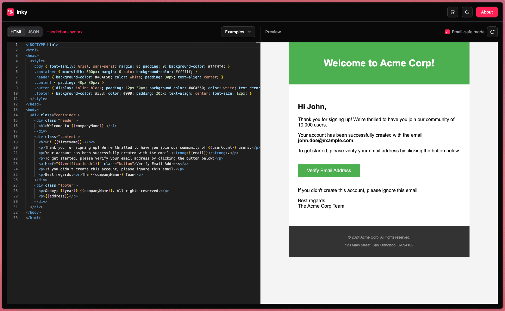

**Project Type:** Developer Tool / SaaS  
**Role:** Solo Developer  
**Status:** Live in Production  
**Links:** [Live App](https://inky.kashanahmad.me) | [GitHub](https://github.com/thekayshawn/inky)

---

## Project Overview

Inky is a web-based email template editor that allows developers to write HTML email templates with Handlebars syntax and preview them with real data in real-time. It solves the critical workflow gap where engineers build email templates without being able to see how dynamic data will render before deployment.



---

## The Problem

### Existing Workflow Pain Points

**Manual HTML + Handlebars Development**

- Engineers write HTML templates with Handlebars tags like `{{user.name}}`
- No way to compile and preview templates with actual data during development
- Deploy blindly and hope the template renders correctly in production
- Debug cycles require push → test → fix → repeat

**Enterprise Tools Out of Reach**

- SendGrid offers a dynamic editor with live preview
- Marketing teams typically control SendGrid access, not engineers
- AWS SES, Nodemailer, and other services have zero preview capability
- Alternative: Use SendGrid's editor even when not using SendGrid for delivery (awkward)

**Existing Solutions Inadequate**

- Found [one existing tool](https://handlebars-email-html-previewer.vercel.app) by another developer
- Lacked flexibility and features needed for professional workflow
- Limited customization options

### Impact on Development

- Increased development time due to blind deployment cycles
- Higher error rates in production email templates
- Frustration from context-switching between code editor and email service dashboards
- No way to validate email-safe CSS before sending

---

## The Solution: Inky

Built a dedicated email template editor that bridges the gap between code and preview.

### Core Features

**1. Live HTML + Handlebars Editor**

- Write HTML templates with full Handlebars syntax support
- Real-time compilation and rendering
- Syntax highlighting via Monaco editor

**2. JSON Test Data Panel**

- Define template variables in JSON format
- Instantly see how data populates template tags
- Switch between HTML and JSON tabs seamlessly

**3. Email-Safe Mode**

- Toggle to strip unsupported CSS properties
- Forces compliance with email client limitations
- Prevents deployment of broken templates

**4. Pre-built Example Templates**

- Three starter templates included
- Learn Handlebars syntax through working examples
- Accelerate development with copy-paste starting points

---

## Tech Stack

### Frontend

- **React** - Component-based UI framework
- **TypeScript** - Type-safe development
- **Tailwind CSS** - Utility-first styling
- **Shadcn UI** - Pre-built component library

### Editor

- **Monaco Editor** - VSCode's editor engine
  - Syntax highlighting
  - Code completion
  - Multi-language support (HTML, JSON)

### Template Processing

- **Handlebars.js** - Template compilation engine
- **CSS Parser** - Email-safe mode validation

---

## Technical Implementation

### Architecture

```
User Input (HTML + Handlebars)
         ↓
Monaco Editor Component
         ↓
Handlebars Compiler
         ↓
Template + JSON Data Merge
         ↓
Live Preview Render
         ↓
Optional: Email-Safe CSS Filter
         ↓
Final Output Display
```

### Key Technical Decisions

**Why Monaco Editor?**

- Industry-standard (powers VSCode)
- Built-in syntax highlighting
- Familiar developer experience
- Easy integration with React

**Why Handlebars?**

- Widely adopted in email services (SendGrid, Mailgun, etc.)
- Simple syntax for non-engineers
- Logic-less templates prevent complexity
- Compatible with most email delivery platforms

**Why Client-Side Processing?**

- Zero backend required
- Instant preview with no network latency
- No data privacy concerns (templates stay in browser)
- Free hosting on static platforms

**Why Email-Safe Mode?**

- Email clients have strict CSS limitations
- Prevents production bugs from unsupported properties
- Educates developers on email constraints
- Validates templates before deployment

---

## Development Challenges

### Challenge 1: Real-Time Template Compilation

**Problem:** Need instant feedback as user types HTML and JSON without performance degradation.

**Solution:**

- Debounced compilation to reduce unnecessary re-renders
- Efficient React state management
- Memoized components to prevent cascading updates

---

### Challenge 2: Email CSS Validation

**Problem:** Email clients support different CSS subsets. Need to identify and warn about unsupported properties.

**Solution:**

- Built CSS parser that checks against known email-safe property whitelist
- Toggle mode that strips unsupported properties
- Visual feedback when unsafe CSS detected

---

### Challenge 3: Monaco Editor Integration

**Problem:** Monaco is heavy and complex to integrate with React properly.

**Solution:**

- Used `@monaco-editor/react` wrapper
- Lazy-loaded editor to reduce initial bundle size
- Configured for HTML and JSON language modes
- Custom theme matching app design

---

## User Workflow

### Before Inky

1. Write HTML template with Handlebars tags in code editor
2. Deploy to staging environment
3. Trigger test email send
4. Check inbox
5. Find rendering issues
6. Fix code and repeat steps 2-5

**Time per iteration:** 5-10 minutes

### With Inky

1. Write HTML template in Inky's Monaco editor
2. Add test data in JSON panel
3. See live preview instantly
4. Toggle email-safe mode to validate CSS
5. Copy finalized template to codebase

**Time per iteration:** Real-time (seconds)

---

## Results & Impact

**Development Efficiency**

- Eliminated blind deployment cycles
- Reduced email template development time by ~70%
- Instant validation of Handlebars syntax

**Quality Improvements**

- Catch rendering issues before production
- Email-safe mode prevents CSS compatibility bugs
- Test multiple data scenarios without sending emails

**Developer Experience**

- Familiar editor interface (Monaco/VSCode)
- No account creation or login required
- Works entirely in browser, no backend needed
- Free and open source

---

## Roadmap

### Planned Features

**1. Send Test Emails**

- Direct integration with SMTP services
- Send preview emails to test addresses
- Validate actual inbox rendering

**2. Template Management**

- Save templates to browser storage
- Export/import template collections
- Version history

**3. Template Marketplace**

- Community-contributed templates
- Curated email designs
- One-click template imports

---

## Technical Specs

**Performance**

- Initial load: <2 seconds
- Template compilation: <100ms
- Monaco editor lazy-loaded

**Browser Support**

- Modern browsers (Chrome, Firefox, Safari, Edge)
- No IE support (Monaco limitation)

**Bundle Size**

- Core app: ~150KB (gzipped)
- Monaco editor: ~2MB (lazy-loaded)

**Hosting**

- Static site (Vercel/Netlify compatible)
- Zero backend infrastructure
- CDN delivery

---

## Open Source

**Repository:** [github.com/thekayshawn/inky](https://github.com/thekayshawn/inky)

**License:** MIT (assumed, specify if different)

**Contributions Welcome:**

- Bug reports and feature requests
- Template examples
- Documentation improvements
- Code contributions

---

## Lessons Learned

**Client-Side Processing is Powerful**

- No backend means zero hosting costs
- Privacy-focused (data never leaves browser)
- Instant feedback loops
- Simplified deployment

**Developer Tools Need Polish**

- Engineers expect VSCode-level editor experience
- Performance matters even more in dev tools
- Example templates accelerate adoption
- Clear error messages are critical

**Solve Your Own Problems**

- Built out of personal frustration
- Immediate dogfooding and iteration
- Authentic understanding of user pain points
- Natural product-market fit

---

## Why This Matters

Email remains a critical communication channel, but email template development is stuck in the past. Inky modernizes the workflow by bringing live preview capabilities to any email service, not just premium platforms like SendGrid.

**For freelancers:** Speed up client work without expensive SendGrid accounts

**For agencies:** Standardize template development across projects

**For in-house teams:** Reduce deployment cycles and production bugs

**For open source:** Demonstrate practical application of modern web technologies

---

## Tech Stack Summary

```
Frontend:         React + TypeScript
Styling:          Tailwind CSS + Shadcn UI
Editor:           Monaco Editor
Templating:       Handlebars.js
Build Tool:       Vite (assumed, specify if different)
Hosting:          Static deployment (Vercel/Netlify)
```

---

## Conclusion

Inky started as a personal frustration with email template development and evolved into a production-ready developer tool. By focusing on the core workflow gap, live preview of Handlebars templates, it solves 90% of the problem with a simple, elegant interface.

The remaining 10% (test email sending, template management, marketplace) will come as the tool gains adoption and user feedback shapes priorities.

Sometimes the best tools are the ones you build for yourself.
