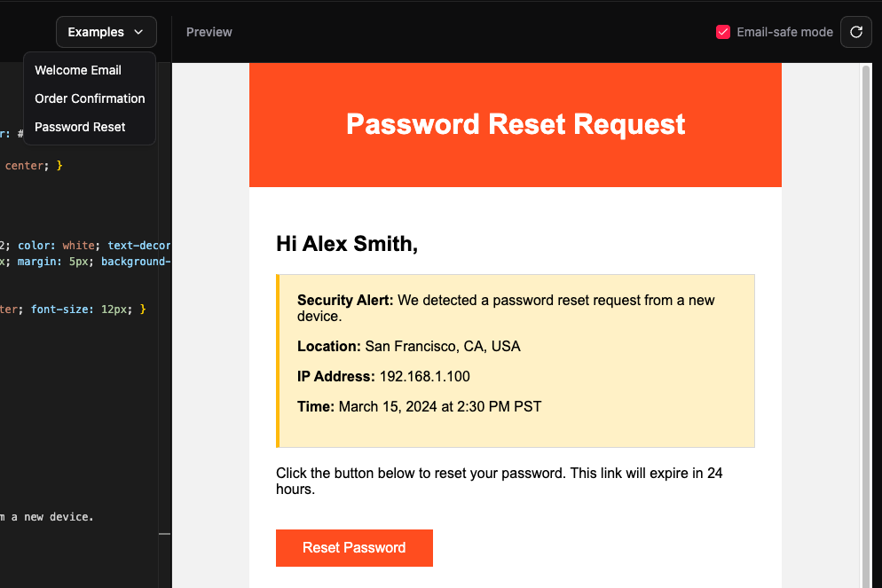

## The pain in the ass

I've been making email templates for the people I work with for quite a while now, and it's a pain in the ass to make plain HTML files work with dynamic data using some templating language such as Handlebars without a proper setup in place.

SendGrid has a dynamic editor, but high chance you're either not using SendGrid or don't have access to it since emails are usually managed by the marketing teams and not engineers.

So, you end up making HTML templates that have these weird tags such as `{{user.name}}` without a way to actually compile the tags and see what the template looks like with actual data.

## The solution

I'd had enough of this, so I decided to fix this problem on my own. I found [an existing tool](https://handlebars-email-html-previewer.vercel.app) that another engineer had made, but it wasn't as flexible as I wanted mine to be.

This gave birth to Inky, which, for now, is just a code editor where you can write your HTML with your Handlebars tags and then provide test data, super similar to what SendGrid's dynamic editor offers.

This fixes 90% of my problems, for now. For the 10%, I'll be adding more things to it as listed in the [roadmap](#roadmap).

Usage is as simple as writing your HTML in the HTML tab, then switching to the JSON tab and adding the test/template data, then using the template data using Handlebars tags.

## Inky ftw baby!

Inky comes with 3 basic example templates for you to play around with before you can start building your own. There is also an "Email-safe mode" toggle that strips away unsupported CSS, which forces you to make templates that actually work.

You can find Inky [here](https://inky.kashanahmad.me), and the source code [here](https://github.com/thekayshawn/inky).

No more second guessing what your email will look like in SendGrid or AWS SES. Do it once, do it right. Chef's (Shaq's) kiss.

## Roadmap

- Send test emails
- Manage templates
- Template marketplace
