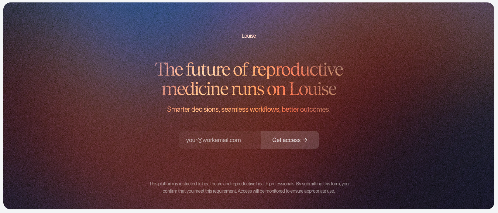

**Company:** Louise (Healthcare SaaS Startup)  
**Role:** Senior Frontend Engineer  
**Project Type:** Healthcare Admin Dashboard for OB/GYN Practices  
**Market:** France & United States

---

## Project Overview

Louise is a practice management platform designed specifically for OB/GYN doctors, providing patient management, medical insights, billing, and treatment tracking in a unified dashboard.

As senior frontend engineer, I built the entire design system from scratch, created the initial version of the application, and pioneered a unique development workflow where investor-ready UI shipped before backend integration, enabling rapid fundraising while engineering caught up.

The platform serves doctors in both France and the United States, requiring multilingual support and cultural localization from day one.



---

## Key Achievements

**Design & Development**

- Built complete design system from scratch with Storybook documentation
- Developed every feature of the app's initial version
- Created dynamic UI architecture (expandable sidebar, patient-specific topbar)
- Transitioned from frontend-only to full-stack role, integrating APIs directly
- Designed and built standout landing page

**Business Impact**

- Enabled CEO to pitch functional-looking app to investors months before backend completion
- Mock UI became production UI without rewrites
- Multilingual support (French/English) accelerated market entry in both France and US
- Accessible design system ensured HIPAA/GDPR compliance readiness

**Technical Leadership**

- Frontend-first development workflow
- Full-stack transition as backend complexity increased (LLM integration)
- Component library with complete Storybook documentation
- Complex components: MultiSelect, Autocomplete, patient-specific dynamic views

---

## Tech Stack

### Frontend Framework

- **Next.js** - React framework with SSR
- **React** - Component architecture
- **TypeScript** - Type-safe development

### Design System

- **Custom Component Library** - Built from scratch
- **Tailwind CSS** - Utility-first styling
- **Storybook** - Component documentation and development
- **Accessibility-first design** - WCAG compliance

### Internationalization

- **i18n (react-i18next)** - Multilingual support
- **French & English** - Full localization including medical terminology

### Integration & API

- **REST API integration** - Backend connectivity
- **LLM integration** - AI-powered features (backend complexity driver)

---

## Development Workflow Innovation

### The Frontend-First Approach

**Traditional Workflow:**

```
Backend APIs built → Frontend consumes APIs → Product ready
```

**Louise Workflow:**

```
Frontend UI built with mock data → CEO pitches to investors →
Backend APIs developed → Frontend integration → Product ready
```

**Why This Worked:**

**Business Advantage**

- CEO could demo functional-looking product immediately
- Investor pitches showed polished UI, not wireframes
- Faster fundraising cycle (UI ready in weeks, not months)
- Product vision communicated visually, not theoretically

**Technical Advantage**

- Frontend defined the API contract (backend built to spec)
- UI/UX iterations happened without backend dependencies
- Mock data forced thinking through edge cases early
- No waiting on backend to start building features

**My Role Evolution**

1. **Phase 1:** Pure frontend with mock data
2. **Phase 2:** Full stack engineers built APIs behind me
3. **Phase 3:** Backend introduced LLM complexity
4. **Phase 4:** I started integrating APIs myself
5. **Final State:** Full stack engineer became backend-only, I owned frontend + integration

**Result:**

- Investor-ready demos months before full functionality
- Zero UI rewrites when APIs arrived
- Smooth transition from mock to live data
- Faster time-to-market

---

## Design System: Built from Scratch

### Philosophy

Healthcare applications require:

- **Accessibility** - WCAG compliance for diverse users
- **Medical data clarity** - Dense information must be scannable
- **Trust signals** - Professional appearance for clinical use
- **Brand identity** - Differentiation in crowded market

### Storybook Documentation

**Every component had its own story**, enabling:

- Visual component catalog
- Interactive props playground
- Accessibility testing
- Responsive design validation
- Onboarding for new developers

**Component Organization:**

```
packages/@louise/ui/
├── form/
│   ├── autocomplete/
│   ├── multi-autocomplete/
│   ├── multi-select/
│   ├── select/
│   ├── input/
│   ├── textarea/
│   ├── number-input/
│   ├── price-input/
│   ├── password-input/
│   ├── phone-input/
│   ├── date-input/
│   ├── time-input/
│   ├── medication-input/
│   ├── checkbox/
│   ├── radio-group/
│   ├── switch/
│   ├── slider/
│   ├── progress/
│   ├── file-upload/
│   └── form.tsx
├── button/
├── card/
├── shiny-card/
├── panel/
├── modal/
├── sheet/
├── alert-modal/
├── dropdown/
├── popover/
├── tooltip/
├── accordion/
├── tabs/
├── table/
├── list/
├── pagination/
├── calendar/
├── avatar/
├── upload-avatar/
├── pill/
├── text/
├── toast/
├── skeleton/
├── loading-overlay/
├── feature-coming-soon-modal/
├── divider.tsx
├── slot.tsx
├── ui.types.ts
└── ui.utils.tsx
```

### Complex Components Built

**1. MultiSelect Component**

**Challenge:** Medical data often requires selecting multiple values (diagnoses, medications, procedures).

**Requirements:**

- Keyboard navigation (accessibility)
- Search/filter functionality
- Selected items display
- Remove individual selections
- Clear all action
- Loading states
- Empty states
- Error states

**Storybook Stories:**

- Default state
- With selections
- Loading state
- Error state
- Disabled state
- Large dataset (performance)
- Keyboard navigation demo

**2. Autocomplete Component**

**Challenge:** Fast lookup for medical terms, patient names, medication database.

**Requirements:**

- Debounced search (performance)
- Keyboard navigation (up/down/enter/esc)
- Highlight matching text
- Recent searches
- Loading indicators
- No results state
- API integration ready

**Storybook Stories:**

- Basic autocomplete
- With API integration
- Async loading
- Keyboard shortcuts
- Custom rendering
- Accessibility features

**3. Expandable Sidebar**

**Challenge:** Dense navigation for multiple feature areas (patients, billing, insights, treatments).

**Features:**

- Collapse/expand animation
- Persistent state (localStorage)
- Active route highlighting
- Nested navigation support
- Responsive behavior (mobile → overlay)
- Keyboard shortcuts (Cmd+B to toggle)

**4. Patient-Specific Dynamic Topbar**

**Challenge:** Contextual information must follow user across app when viewing patient.

**Features:**

- Patient name and basic info always visible
- Quick actions (message, schedule, billing)
- Breadcrumb navigation
- Dynamic based on patient context
- Smooth transitions between patients

---

## Multilingual Support (i18n)

### Challenge

Serve both French and US markets with:

- Different languages (French, English)
- Medical terminology differences
- Date/time format differences (DD/MM/YYYY vs MM/DD/YYYY)
- Currency differences (€ vs $)
- Regulatory compliance text (GDPR vs HIPAA)

### Implementation

**react-i18next Integration**

```typescript
// Translation structure
translations/
├── en/
│   ├── common.json
│   ├── patient.json
│   ├── billing.json
│   ├── insights.json
│   └── medical-terms.json
└── fr/
    ├── common.json
    ├── patient.json
    ├── billing.json
    ├── insights.json
    └── medical-terms.json
```

**Component Usage:**

```typescript
import { useTranslation } from "@/app/translations";

async function PatientDashboard() {
  const t = useTranslation("patient");
  const patient = await getPatient();

  return (
    <div>
      <h1>{t("dashboard.title")}</h1>
      <p>{t("dashboard.subtitle", { params: { name: patient.name } })}</p>
    </div>
  );
}
```

**Challenges Solved:**

**1. Medical Terminology**

- Different terms in French vs English medical contexts
- Worked with medical professionals to ensure accuracy
- Created comprehensive medical terms glossary

**2. Cultural Localization**

- Date formats (FR: DD/MM/YYYY, US: MM/DD/YYYY)
- Time formats (24h vs 12h)
- Name ordering (FR: surname first in some contexts)
- Address formats

**3. Dynamic Content**

- Pluralization rules differ (French has more complexity)
- Gender agreement in French
- Number formatting (1,000.00 vs 1 000,00)

**Result:**

- French doctors felt at home in the interface
- US doctors had familiar terminology and formats
- Easier market entry in both regions
- Reduced onboarding friction significantly

---

## Core Features Built

### 1. Billing Management

**Invoice Generation**

- Itemized billing
- Insurance integration ready
- Payment tracking
- Outstanding balance alerts
- PDF export

**Payment Processing**

- Multiple payment methods
- Payment history
- Refund processing
- Revenue analytics

### 2. Treatment Tracking

**Treatment Plans**

- Create and manage treatment protocols
- Progress tracking
- Medication schedules
- Follow-up reminders

**Medical Records**

- Structured data entry
- Document attachments
- Version history
- Audit logs (compliance)

### 3. Dashboard & Analytics

**Overview Dashboard**

- Key metrics (patient count, revenue, appointments)
- Upcoming appointments
- Recent activity
- Quick actions

**Analytics & Insights**

- Practice performance metrics
- Patient demographics
- Revenue trends
- Treatment outcomes (when LLM integrated)

---

## Landing Page: Unique out of the box approach

### Concept

Rather than a traditional landing page, the CEO asked me to create something way more unique.

**Design Philosophy:**

- Show, don't tell
- Immersive storytelling
- Emotional connection with target audience (doctors)
- Premium feel (justifies SaaS pricing)

**Result:**

- "Super cool" visual impact (CEO's words)
- Higher investor engagement during pitches
- Memorable brand experience
- Increased demo request conversion

---

## Technical Challenges

### Challenge 1: Frontend-First API Contract Definition

**Problem:** Building UI before APIs exist requires predicting data structures.

**Approach:**

- Defined TypeScript interfaces for all data models
- Created comprehensive mock data generators
- Documented API contracts in Storybook
- Shared contracts with backend team

**Mock Data Strategy:**

```typescript
// Patient mock data
const mockPatient: Patient = {
  id: "123",
  firstName: "Jane",
  lastName: "Doe",
  dateOfBirth: "1985-06-15",
  email: "jane.doe@example.com",
  phone: "+1234567890",
  address: {
    /* ... */
  },
  medicalHistory: [
    /* ... */
  ],
  appointments: [
    /* ... */
  ],
  billing: {
    /* ... */
  },
};
```

**Result:**

- Backend built APIs matching frontend expectations
- Minimal contract renegotiation
- Smooth integration when APIs arrived

---

### Challenge 2: LLM Integration Complexity Shift

**Context:** Backend introduced LLM for medical insights, changing my role.

**Initial Setup:**

- Backend team handled all API integration
- I focused purely on UI/UX

**Why It Changed:**

- LLM added significant backend complexity
- Backend engineer needed to focus on AI/ML pipeline
- Frontend-backend integration becoming bottleneck

**My Transition:**

- Started integrating APIs myself
- Learned backend codebase enough to debug integration issues
- Full stack engineer became backend-only
- I became frontend + integration layer

**New Responsibilities:**

- API client implementation
- State management for async data
- Error handling and retry logic
- Loading states and optimistic updates
- Caching strategies

**Result:**

- Faster feature shipping (no handoff delays)
- Better understanding of full system
- More efficient debugging
- Backend engineer could focus on LLM optimization

---

### Challenge 3: Healthcare Data Density

**Problem:** OB/GYN practices have incredibly dense medical data. UI must present it clearly without overwhelming doctors.

**Strategies:**

**1. Progressive Disclosure**

- Show summary, hide details by default
- Expandable sections for depth
- Drill-down navigation

**2. Visual Hierarchy**

- Typography scale for importance
- Color coding for status/severity
- Whitespace for breathing room

**3. Data Visualization**

- Charts for trends over time
- Graphs for complex relationships
- Status indicators for quick scanning

**4. Smart Defaults**

- Most relevant information first
- Customizable views (save preferences)
- Recently accessed items

**Result:**

- Doctors could scan patients quickly
- Deep information available when needed
- Reduced cognitive load
- Positive user feedback on clarity

---

### Challenge 4: Accessibility in Complex Components

**Problem:** MultiSelect and Autocomplete must be fully keyboard-navigable and screen-reader friendly.

**Implementation:**

**Keyboard Navigation:**

- Tab: Move between fields
- Arrow keys: Navigate options
- Enter: Select option
- Escape: Close dropdown
- Backspace: Remove last selection (MultiSelect)

**Screen Reader Support:**

- ARIA roles (combobox, listbox, option)
- ARIA labels describing purpose
- Live regions for dynamic updates
- Status announcements (X items selected)

**Focus Management:**

- Visible focus indicators
- Focus trap in modals
- Return focus on close
- Skip links for long lists

**Testing:**

- Keyboard-only navigation testing
- VoiceOver (Mac) testing
- NVDA (Windows) testing
- Accessibility audits (Lighthouse, axe)

**Result:**

- WCAG AA compliance
- Usable by doctors with disabilities
- Better UX for all users (keyboard shortcuts)

---

## Results & Impact

### Business Impact

- **Investor pitches** - Functional UI enabled fundraising before backend completion
- **Faster time-to-market** - Mock UI became production UI without rewrites
- **Market expansion** - French/English support opened both US and France markets
- **User satisfaction** - Doctors praised interface clarity and design

### Technical Impact

- **Design system adoption** - All features built with consistent components
- **Development velocity** - Storybook enabled parallel development
- **Code quality** - TypeScript + comprehensive components reduced bugs
- **Accessibility** - WCAG compliance from day one, not retrofitted

### Personal Growth

- **Design system architecture** - Built production-grade component library from scratch
- **Frontend-first workflow** - Pioneered development approach enabling business goals
- **Full-stack transition** - Expanded from frontend to API integration
- **Healthcare domain** - Learned medical terminology and healthcare compliance needs
- **Multilingual implementation** - Mastered i18n for complex medical application

---

## Key Learnings

### Frontend-First Development

**Advantages:**

- Business can move faster than engineering
- UI defines API contracts (clearer requirements)
- Product vision demonstrated visually
- Fundraising not blocked by backend

**Challenges:**

- Mock data must be realistic
- Contract changes painful if predicted wrong
- Temptation to over-engineer before understanding backend constraints

**When It Works:**

- Startups needing investor demos
- Clear product vision exists
- Frontend-backend contract can be defined upfront
- Business timeline more aggressive than engineering timeline

### Design Systems

**Build vs Buy:**

- Built from scratch because: Healthcare needs, brand identity, learning opportunity
- Would use shadcn/Radix today for faster start

**Storybook Value:**

- Component documentation saves onboarding time
- Visual testing catches regressions
- Accessibility testing built into workflow
- Living style guide for designers

**Accessibility First:**

- Easier to build accessible than retrofit
- Keyboard navigation benefits all users
- Screen reader testing reveals UX issues

### Healthcare Domain

**Complexity:**

- Medical terminology must be precise
- Data density requires thoughtful hierarchy
- Compliance (HIPAA/GDPR) constrains design decisions
- Trust and professionalism non-negotiable

**Multilingual:**

- Medical terms differ culturally, not just linguistically
- Date/time/number formatting critical for healthcare
- Professional translation required (not Google Translate)

---

## Tech Stack Summary

```
Framework:           Next.js + React + TypeScript
Design System:       Custom (Tailwind CSS + Storybook)
Components:          MultiSelect, Autocomplete, Dynamic layouts
Internationalization: react-i18next (French, English)
Development:         Frontend-first workflow with mock data
API Integration:     REST APIs, LLM integration
Accessibility:       WCAG AA compliant
Documentation:       Storybook for all components
```

---

## Conclusion

Louise demonstrated that frontend engineering can senior product development, not just follow it. By building investor-ready UI months before backend completion, the business could fundraise and validate product vision while engineering caught up.

Building a design system from scratch with comprehensive Storybook documentation created a foundation that accelerated all subsequent development. Complex components like MultiSelect and Autocomplete, built with accessibility as a priority, proved that healthcare applications can be both powerful and usable.

The multilingual implementation (French/English) with proper medical terminology localization opened two markets simultaneously, demonstrating that thoughtful internationalization isn't overhead, it's strategic business value.

Transitioning from pure frontend to full-stack as the backend introduced LLM complexity showed adaptability: when backend became the bottleneck, I expanded my role rather than waiting for handoffs.

Frontend-first development isn't always the answer, but for Louise, it was the right bet: investor funding secured, product vision validated, and a polished UI that became production-ready without rewrites.
