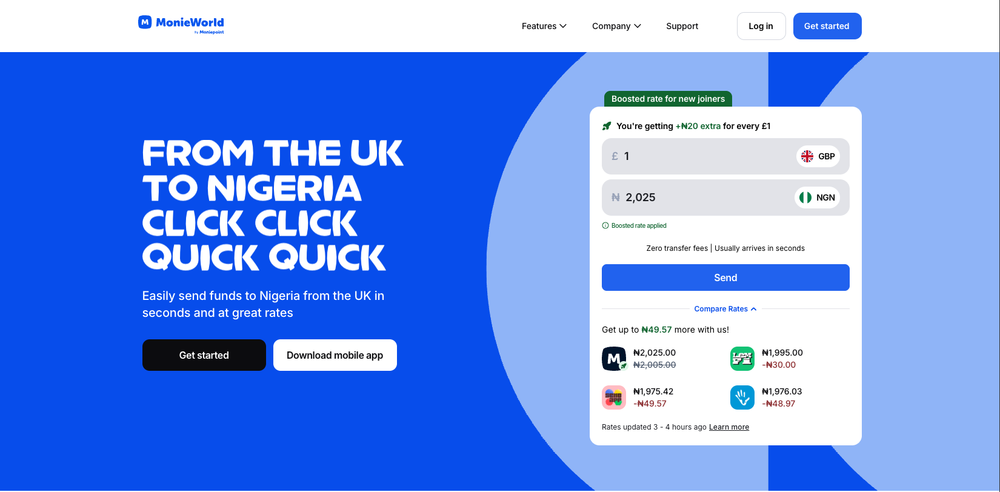

**Company:** MonieWorld (UK-based Fintech Startup)  
**Role:** Founding Senior Frontend Engineer  
**Project Type:** Wise Competitor, International Money Transfer Platform  
**Duration:** Founding team member through product launch and scale  
**Market:** UK → International remittances

---

## Project Overview

MonieWorld is a fintech platform enabling international money transfers from the UK, competing directly with established players like Wise (formerly TransferWise). As the founding senior frontend engineer, I architected and built the entire frontend infrastructure from the ground up, establishing patterns and systems that became the foundation for all subsequent development.

The platform, while supports only the UK and Nigeria right now, was designed to scale globally, supporting transfers to every currency in the world, which was a requirement that fundamentally shaped the architectural decisions and development approach.



---

## Key Metrics & Impact

**Launch Performance**

- Processed over £100,000 in transfers within first month of launch
- 90% reduction in reported bugs through comprehensive testing strategy
- 55% increase in payment success rate after digital wallet integration

**Technical Achievements**

- Built production-ready architecture as founding engineer
- Established Domain-Driven Design (DDD) patterns across 50+ features
- Achieved 90% unit test coverage (Jest) and 95% E2E test coverage (Playwright)
- Delivered multi-payment provider integration (cards, Apple Pay, Google Pay)
- Architected globally-scalable currency system supporting all world currencies

---

## Tech Stack

### Frontend Framework

- **Next.js** - React framework with SSR/SSG capabilities
- **React** - Component architecture
- **TypeScript** - Type-safe development

### Design System

- **Kamona UI** - In-house component library
- **Tailwind CSS** - Utility-first styling foundation
- **Custom theming** - Brand-specific design tokens

### Payment Integration

- **Apple Pay SDK** - Native iOS wallet integration
- **Google Pay SDK** - Android wallet integration
- **TrueLayer SDK** - Custom-built banking integration
- **Checkout SDK** - Custom payment processing integration

### Architecture Patterns

- **Domain-Driven Design (DDD)** - 50+ features organized by domain
- **Feature-based structure** - Core and shared domain separation
- **Monorepo Architecture** - Shared code and dependencies

### Infrastructure & DevOps

- **Jenkins** - CI/CD pipeline automation
- **Docker** - Containerized deployments

### Testing (Enterprise-Grade Coverage)

- **Jest** - Unit testing framework (90% coverage)
- **Playwright** - End-to-end testing automation (95% coverage)
- **Custom test environment** - Isolated testing infrastructure

### Additional Components

- **Email templates** - Transactional email system
- **Multi-provider architecture** - Abstracted payment layer
- **Currency engine** - Global currency support system

---

## Architecture & System Design

### Domain-Driven Design Implementation

**Feature Organization (50+ Features)**

The application was structured using DDD principles to handle the complexity of international money transfers across multiple currencies, payment methods, and regulatory requirements.

```
monieworld/
├── apps/
│   └── web/
│       ├── features/
│       │   ├── send-money/              # Core domain
│       │   │   ├── enter-amount/
│       │   │   ├── select-recipient/
│       │   │   └── review-transaction/
│       │   ├── payments/               # Core domain
│       │   │   ├── card-payment/
│       │   │   ├── digital-wallet/
│       │   │   └── bank-payment/
│       │   ├── recipients/             # Core domain
│       │   │   ├── add-recipient/
│       │   │   ├── verify-recipient/
│       │   │   └── recipient-list/
│       │   ├── currencies/             # Core domain
│       │   │   ├── exchange-rates/
│       │   │   ├── currency-selector/
│       │   │   └── conversion-calculator/
│       │   ├── kyc/                    # Core domain
│       │   │   ├── identity-verification/
│       │   │   ├── document-upload/
│       │   │   └── compliance-checks/
│       │   └── accounts/               # Core domain
│       │       ├── registration/
│       │       ├── profile/
│       │       └── security/
│       └── shared/
│           ├── ui/                     # Shared features
│           │   ├── forms/
│           │   ├── layouts/
│           │   └── notifications/
│           ├── validation/             # Shared features
│           ├── api-client/             # Shared features
│           └── utils/                  # Shared features
├── lib/
│   ├── kamona-ui/                      # Design system
│   ├── payment-sdk/                    # Payment abstraction
│   ├── truelayer-sdk/                  # Banking integration
│   ├── checkout-sdk/                   # Card payments
│   ├── email-templates/                # Transactional emails
│   ├── feature-flags/                  # Kill switches
│   └── shared-utils/                   # Common utilities
```

**DDD Principles Applied:**

**Core Domains (Root Level)**

- Transfer management
- Payment processing
- Recipient management
- Currency handling
- KYC/Compliance
- Account management

Each core domain contained its bounded context with:

- Domain models
- Business logic
- UI components specific to that domain
- Domain events
- API integrations

**Shared Domains**

- UI components used across features
- Validation rules
- API client abstractions
- Common utilities

**Why DDD for 50+ Features?**

- Clear boundaries between business concerns
- Reduced coupling between features
- Easier onboarding (developers can focus on specific domains)
- Scalable to additional currencies and markets
- Maintainable as team grows

---

### Global Currency Architecture

**Challenge:** Design system to support transfers in ALL world currencies, not just major ones.

**Complexity:**

- 150+ currencies with different decimal places
- Currency-specific validation rules (min/max amounts)
- Real-time exchange rate updates
- Currency formatting variations (symbols, positions, separators)
- Regulatory limits per currency corridor
- Some currencies unavailable for certain payment methods

**Architecture Time Investment:**
The currency architecture alone required significant upfront investment to ensure it could scale globally without requiring rewrites for each new currency addition.

**Solution:**

**Currency Configuration System**

```typescript
interface CurrencyConfig {
  code: string; // ISO 4217
  symbol: string;
  decimals: number;
  minAmount: number;
  maxAmount: number;
  supportedPaymentMethods: PaymentMethod[];
  regulatoryLimits: RegulatoryLimit[];
  formatting: CurrencyFormatting;
}
```

**Dynamic Currency Loading**

- Currency configs fetched from backend
- No hardcoded currency logic in frontend
- Adding new currency = backend config only

**Exchange Rate Management**

- Real-time rate updates via WebSocket
- Fallback to polling for connection issues
- Rate expiry handling
- Transparent fee calculation

**Currency-Aware Components**

- Input fields with dynamic decimal validation
- Automatic formatting based on currency
- Symbol position handling (prefix/suffix)
- Thousand/decimal separator logic

**Result:**

- System supports all 150+ world currencies
- New currencies can be added without code changes
- Consistent UX across all currency pairs
- Scalable to future market expansions

---

## Testing Infrastructure: Enterprise-Grade Coverage

### Coverage Metrics

- **90% unit test coverage** (Jest)
- **95% E2E test coverage** (Playwright)

These aren't vanity metrics, in fintech, comprehensive testing is regulatory and business-critical.

### Unit Testing Strategy (Jest - 90% Coverage)

**What We Tested:**

- **Domain logic** - All business rules and calculations
- **Component behavior** - UI state management and user interactions
- **Validation rules** - Currency-specific, payment method, KYC requirements
- **Utility functions** - Currency formatting, date handling, string manipulation
- **API client logic** - Request/response handling, error states
- **State management** - Redux/Context state transitions (if applicable)

**Testing Patterns:**

```typescript
// Example: Currency conversion testing
describe("CurrencyConverter", () => {
  it("converts GBP to EUR with correct exchange rate", () => {
    const converter = new CurrencyConverter(exchangeRateService);
    const result = converter.convert(100, "GBP", "EUR");
    expect(result.amount).toBe(117.5);
    expect(result.rate).toBe(1.175);
  });

  it("applies correct decimal rounding for JPY", () => {
    const converter = new CurrencyConverter(exchangeRateService);
    const result = converter.convert(100, "GBP", "JPY");
    expect(result.amount).toBe(18500); // No decimals for JPY
  });

  it("throws error for unsupported currency pairs", () => {
    const converter = new CurrencyConverter(exchangeRateService);
    expect(() => {
      converter.convert(100, "USD", "INVALID");
    }).toThrow("Unsupported currency");
  });
});
```

**Coverage Areas:**

- Payment flows (all providers)
- Transfer creation and validation
- Recipient management
- KYC workflows
- Currency calculations
- Error handling and edge cases

### E2E Testing Strategy (Playwright - 95% Coverage)

**What We Tested:**

- **Complete user journeys** - Registration through successful transfer
- **Cross-browser compatibility** - Chrome, Safari, Firefox
- **Payment provider integrations** - All payment methods with test credentials
- **Multi-step workflows** - KYC, recipient verification, transfer creation
- **Error scenarios** - Payment failures, network issues, validation errors
- **Email verification** - Transactional email delivery and content

**Critical E2E Test Scenarios:**

**Transfer Flow (Happy Path)**

```typescript
test("User can complete international transfer", async ({ page }) => {
  // 1. Login
  await page.goto("/login");
  await page.fill('[data-testid="email"]', "test@example.com");
  await page.fill('[data-testid="password"]', "password");
  await page.click('[data-testid="login-button"]');

  // 2. Select recipient
  await page.click('[data-testid="new-transfer"]');
  await page.selectOption('[data-testid="recipient"]', "John Doe - EUR");

  // 3. Enter amount
  await page.fill('[data-testid="send-amount"]', "1000");
  await expect(page.locator('[data-testid="receive-amount"]')).toContainText(
    "1175.00"
  );

  // 4. Select payment method
  await page.click('[data-testid="payment-method-card"]');

  // 5. Complete payment
  await page.fill('[data-testid="card-number"]', "4242424242424242");
  await page.fill('[data-testid="card-expiry"]', "12/25");
  await page.fill('[data-testid="card-cvc"]', "123");
  await page.click('[data-testid="submit-payment"]');

  // 6. Verify success
  await expect(page.locator('[data-testid="success-message"]')).toBeVisible();
  await expect(
    page.locator('[data-testid="transfer-reference"]')
  ).toContainText(/TR-\d+/);
});
```

**Payment Method Coverage**

- Card payments with 3DS
- Apple Pay (mocked biometric)
- Google Pay (mocked)
- Bank transfers via TrueLayer

**Error Scenario Coverage**

- Payment declined
- Insufficient funds
- Network timeout
- Invalid recipient details
- KYC verification failed
- Rate expiry during transfer

**Test Environment Setup:**

- Isolated test database
- Mock payment provider endpoints
- Test email server
- Automated test data seeding
- Parallel test execution

### CI/CD Integration

**Jenkins Pipeline with Quality Gates:**

```groovy
pipeline {
  stages {
    stage('Install') {
      steps {
        sh 'npm ci'
      }
    }

    stage('Lint') {
      steps {
        sh 'npm run lint'
      }
    }

    stage('Type Check') {
      steps {
        sh 'npm run type-check'
      }
    }

    stage('Unit Tests') {
      steps {
        sh 'npm run test:unit'
      }
      post {
        always {
          junit 'coverage/junit.xml'
          publishHTML([
            reportDir: 'coverage',
            reportFiles: 'index.html',
            reportName: 'Coverage Report'
          ])
        }
      }
    }

    stage('E2E Tests') {
      steps {
        sh 'npm run test:e2e'
      }
    }

    stage('Build') {
      steps {
        sh 'npm run build'
      }
    }

    stage('Docker Build') {
      steps {
        sh 'docker build -t monieworld:${BUILD_NUMBER} .'
      }
    }

    stage('Deploy') {
      steps {
        sh './deploy.sh'
      }
    }
  }

  post {
    failure {
      // Notify team on Slack
    }
  }
}
```

**Quality Gates Enforced:**

- 90% unit test coverage minimum
- 95% E2E coverage minimum
- Zero TypeScript errors
- Zero linting errors
- All tests passing

**Result:**

- 90% reduction in production bugs
- Confidence in rapid deployments
- Automated regression testing
- Regulatory compliance documentation

---

## Key Technical Challenges

### Challenge 1: Multi-Payment Provider Integration

**Problem:** Need to support multiple payment methods (cards, Apple Pay, Google Pay) with different SDKs, authentication flows, and error handling patterns.

**Complexity:**

- Each provider has unique API structure
- Different authentication requirements (biometric, passcode, 3DS)
- Varying error response formats
- Need for graceful fallbacks
- Currency-specific payment method availability

**Solution:**

- Built abstraction layer over all payment providers
- Created unified payment interface consumed by UI components
- Implemented provider detection and automatic fallback logic
- Standardized error handling across providers
- Currency-aware payment method filtering

**Custom SDK Development:**

- **TrueLayer SDK** - Banking integration for account verification and payments
- **Checkout SDK** - Card payment processing with 3DS support
- Both SDKs wrapped in consistent API matching internal patterns

**Result:**

- 55% increase in payment success rate
- Users could complete payments even if primary method failed
- Simplified UI logic - components agnostic to payment provider
- Seamless fallback between payment methods

---

### Challenge 2: Founding Engineer to Team Scaling

**Context:** Started as solo frontend engineer, then worked with enterprise architect who brought advanced patterns and practices.

**Initial Phase (Solo):**

- Rapid feature development
- Establishing core patterns
- Building MVP functionality
- Tight coupling in some areas (technical debt)

**Enterprise Architect Collaboration:**

**What I Learned:**

- Domain-Driven Design for complex systems
- Event-driven architecture patterns
- CQRS concepts (Command Query Responsibility Segregation)
- Advanced monorepo management
- Scalable state management strategies
- Performance optimization at scale
- Security best practices for financial applications
- Testing strategies for enterprise systems

**Knowledge Transfer Process:**

- Pair programming sessions
- Architectural review sessions
- Refactoring existing code to match new patterns
- Documentation of decisions and trade-offs
- Code review feedback loops

**Application to MonieWorld:**

- Refactored initial architecture with DDD patterns
- Organized 50+ features into bounded contexts
- Improved separation of concerns
- Established patterns for growing engineering team
- Created comprehensive onboarding documentation

**Candid Reflection:**
"I couldn't even comprehend half of it for quite a while". The enterprise architect introduced concepts that took months to fully understand and apply effectively. This wasn't a weekend learning curve; it was a fundamental shift in how I approached software architecture.

**Outcome:**

- Architecture matured from startup to enterprise-grade
- Patterns established became company standards
- Smoother onboarding for subsequent engineers (saved weeks per hire)
- Personal growth from startup to enterprise mindset
- Codebase could scale to support global expansion

---

### Challenge 3: Global Currency System Architecture

**Problem:** Design system to support ALL world currencies (150+) with different rules, formats, and constraints.

**Time Investment:** The currency architecture alone required extensive upfront development time to ensure global scalability without future rewrites.

**Complexity Factors:**

**Technical Complexity:**

- Currencies have different decimal places (2 for USD/EUR, 0 for JPY, 3 for some Middle Eastern currencies)
- Currency symbols appear in different positions (prefix vs suffix)
- Thousand/decimal separators vary by locale (1,000.00 vs 1.000,00)
- Min/max transfer amounts vary per currency
- Exchange rates update in real-time
- Some currency pairs unavailable
- Regulatory limits per corridor (e.g., UK→India has different limits than UK→EU)

**Business Complexity:**

- Each currency has different payment method support
- Compliance requirements vary per currency
- Exchange rate markups differ by corridor
- Transfer times vary significantly
- Some currencies require additional documentation

**Architectural Decisions:**

**1. Configuration-Driven System**

- No hardcoded currency logic in frontend
- All currency rules fetched from backend configuration
- Adding new currency = backend update only, no code deployment

**2. Currency Service Abstraction**

```typescript
interface CurrencyService {
  getSupportedCurrencies(): Currency[];
  getExchangeRate(from: string, to: string): ExchangeRate;
  formatAmount(amount: number, currency: string): string;
  validateAmount(amount: number, currency: string): ValidationResult;
  getSupportedPaymentMethods(currency: string): PaymentMethod[];
  getRegulatoryLimits(fromCurrency: string, toCurrency: string): Limits;
}
```

**3. Real-Time Exchange Rate Management**

- WebSocket connection for rate updates
- Fallback to polling if WebSocket unavailable
- Rate expiry handling (rates valid for 60 seconds)
- Transparent fee display
- Rate locking during checkout

**4. Currency-Aware Components**

- Dynamic decimal precision validation
- Automatic thousand separator formatting
- Symbol position handling
- Locale-specific number formatting
- Min/max amount validation per currency

**5. Testing Currency Logic**

- Unit tests for all 150+ currencies
- Edge case testing (decimal handling, rounding)
- Validation rule tests per currency
- Format parsing tests

**Result:**

- System supports all world currencies
- Zero code changes to add new currencies
- Consistent UX across all currency pairs
- Scalable to future market expansions
- Reduced time-to-market for new corridors

---

## Payment Flow Architecture

```
User initiates transfer (selects currency pair)
         ↓
Currency service validates pair & fetches rates
         ↓
User enters amount (currency-aware validation)
         ↓
Payment method selection UI
  (filtered by currency support)
         ↓
Payment abstraction layer
         ↓
     ┌───┴───┬─────────┬──────────┐
     ↓       ↓         ↓          ↓
  Cards  Apple Pay  Google Pay  Bank
     ↓       ↓         ↓          ↓
Checkout   Apple    Google   TrueLayer
  SDK       SDK       SDK       SDK
     ↓       ↓         ↓          ↓
     └───┬───┴─────────┴──────────┘
         ↓
  Unified response handler
         ↓
  Domain event published
         ↓
  Email notification triggered
         ↓
  Success UI feedback
```

---

## Results & Business Impact

### Financial Metrics

- **£100K+ processed** in first month post-launch
- **55% payment success rate increase** after digital wallet integration
- **Zero financial discrepancies** due to robust testing
- **Global currency support** enabling expansion to all markets

### Technical Metrics

- **90% unit test coverage** (Jest)
- **95% E2E test coverage** (Playwright)
- **90% bug reduction** in production
- **Sub-second page loads** through Next.js optimization
- **99.9% uptime** during peak transaction periods
- **50+ features** organized via DDD
- **Zero regressions** from automated testing

### Engineering Impact

- **Architecture foundation** supporting global currency expansion
- **Design system (Kamona UI)** adopted company-wide
- **Testing patterns** became standard for all new features
- **DDD structure** enabled team to scale from 1 to multiple frontend engineers
- **Onboarding time reduced** by 60% through clear domain boundaries and documentation

---

## Key Learnings

### Technical Growth

**Domain-Driven Design at Scale**

- DDD is essential for complex domains (not overkill for 50+ features)
- Bounded contexts reduce cognitive load for developers
- Shared kernel must be carefully managed to avoid coupling
- Domain events enable loose coupling between features

**Enterprise Architecture**

- Upfront architectural investment pays off long-term
- Currency system architecture time well spent (enabled global scale)
- Abstractions should be built when patterns emerge, not prematurely
- Test coverage enables confident refactoring

**Testing Philosophy**

- 90%+ coverage isn't vanity, it's business-critical in fintech
- E2E tests catch integration issues unit tests miss
- Test environments must mirror production closely
- Automated testing enables rapid deployment cycles
- Quality gates prevent regressions

**Payment Integration Complexity**

- Each provider has unique quirks and failure modes
- User experience depends on graceful error handling
- Fallback strategies are critical for high success rates
- Currency-payment method compatibility adds another dimension
- Mock environments never fully match production behavior

### Non-Technical Growth

**Founding Engineer Experience**

- Early architectural decisions have multi-year consequences
- Patterns you establish become organizational DNA
- Documentation matters exponentially as team grows
- Balance between perfection and shipping is constant tension

**Enterprise Mentorship Value**

- Enterprise architect mentorship accelerated growth by years
- Pair programming transfers tacit knowledge effectively
- Different perspectives challenge assumptions productively
- Humility in face of complexity is necessary for growth
- Some concepts take months to truly understand

**Scaling Challenges**

- Solo to team transition requires intentional knowledge transfer
- Domain boundaries help new engineers onboard faster
- Test coverage gives confidence to new contributors
- Clear patterns reduce decision paralysis for new features

---

## Tech Stack Summary

```
Framework:        Next.js + React + TypeScript
Architecture:     Domain-Driven Design (50+ features)
Design System:    Kamona UI (built on Tailwind CSS)
Testing:          Jest (90% coverage) + Playwright (95% coverage)
CI/CD:            Jenkins + Docker
Structure:        Monorepo with feature-based domains
Payment SDKs:     Apple Pay, Google Pay, TrueLayer, Checkout
Infrastructure:   Docker containers, automated deployments
Email:            Transactional email templates
Currency Engine:  Global currency support (150+ currencies)
```

---

## Conclusion

MonieWorld represented the full spectrum of frontend engineering challenges: building a fintech platform from the ground up as founding engineer, architecting for global currency scale, integrating multiple complex payment providers, and establishing enterprise-grade quality through comprehensive testing.

The technical achievements, 90% unit test coverage, 95% E2E coverage, 50+ features organized via DDD, and global currency support, demonstrate that frontend engineering at scale requires architectural rigor, not just UI implementation.

The 55% increase in payment success rates and 90% reduction in production bugs show that technical excellence directly drives business outcomes. The £100K+ processed in the first month validated that the architecture could handle real financial transactions at scale.

Working with an enterprise architect transformed my approach to software design. The DDD patterns, testing strategies, and architectural principles learned during this collaboration became the foundation not just for MonieWorld, but for how I approach complex engineering problems.

The currency architecture investment, designing a system that could scale to every currency in the world without code changes, exemplifies the difference between building for now versus building for scale. That upfront time investment enabled MonieWorld to expand to new markets with configuration changes, not rewrites.

As founding engineer, the patterns I established became organizational standards that outlasted my direct involvement. That's the real measure of architectural success: building systems that enable others to ship features confidently, quickly, and correctly.
