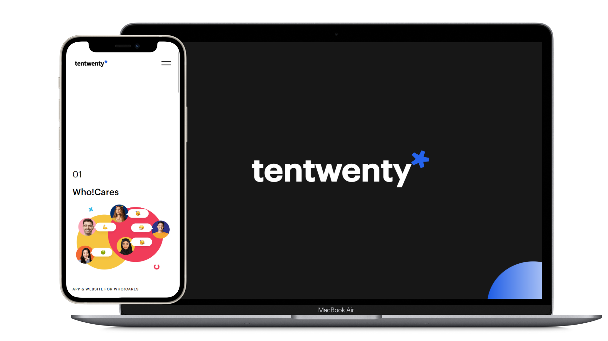
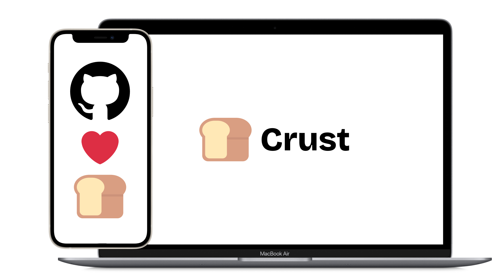
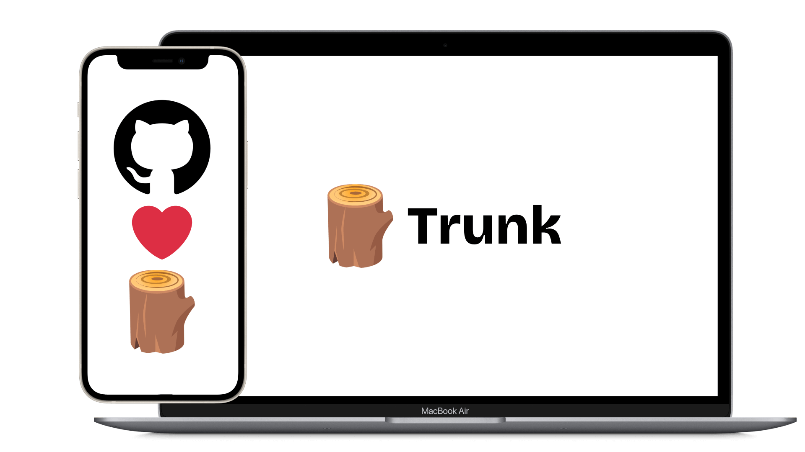
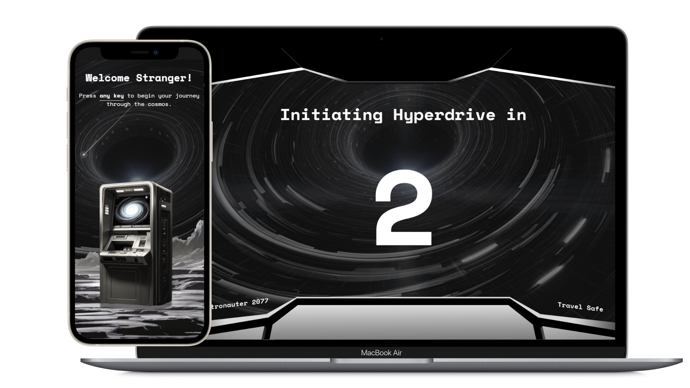
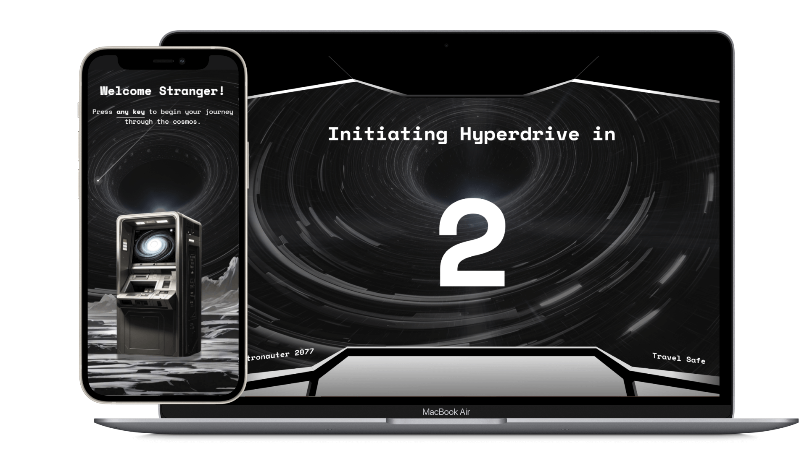
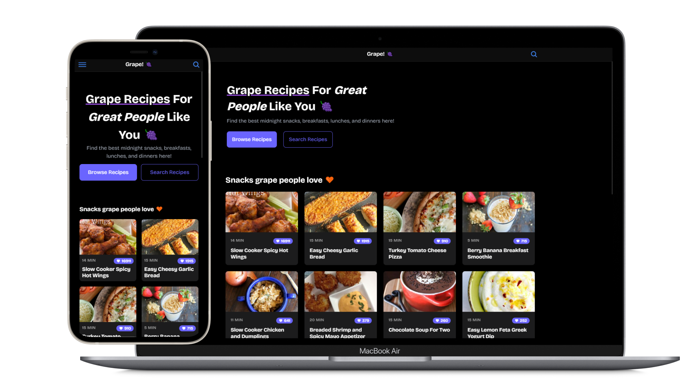
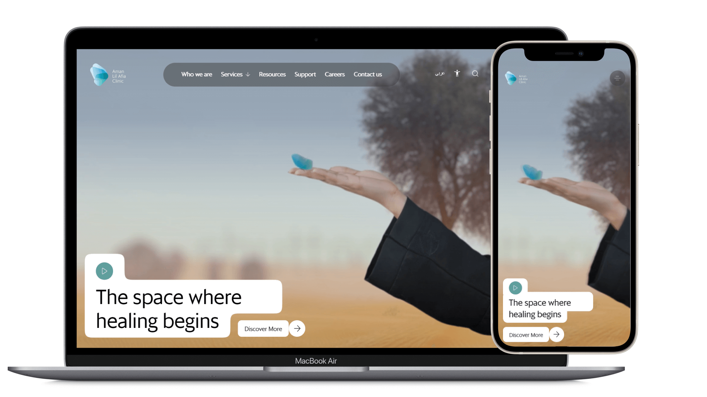
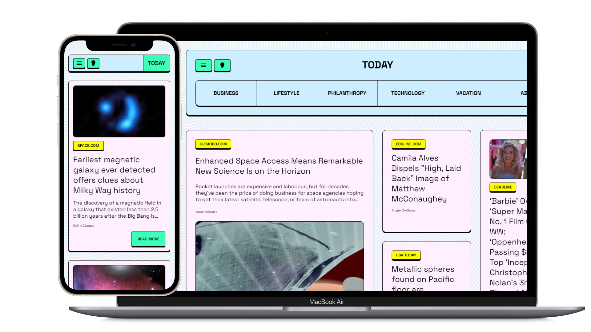

## 🌟 Tentwenty's Portfolio Clone

A pixel-perfect clone of tentwenty's masterpiece with enhanced performance and smooth animations. Built with React, GSAP, and Tailwind CSS to showcase advanced frontend skills.

## 📗 TheTutor.me

TheTutor.me is an EdTech platform that connects students with tutors. The platform comprises of 4 web apps and a website, built with React, Redux, and TypeScript.

## 🍞 Crust

A simple boilerplate for creating NPM packages. Includes a basic config for TypeScript, ESLint, Prettier, Vitest, and Changesets - everything you need to get started quickly.

## Trunk

The sassiest JavaScript utilities in town + Add your own! A suite of tested functions I use regularly in my JavaScript applications, available as an open-source NPM package.

## 🚀 Kashtronauter 2077

A space ship built with HTML, CSS, and JS that literally jumps to hyperspace! A fun interactive experience showcasing creative frontend development.

## 🟣 Sassywares

A suite of SaaS apps that I'm building to showcase my skills and to help people. The main website showcases various tools and applications.

## 🍇 Grape!

Grape is a collection of recipes for everyone. It's going to be the last fitness app you'll ever need, built as a Progressive Web App with Ionic and React.

## 😇 Chearful's Portfolio Draft

Chearful was a med-tech startup in Dubai, UAE. This website was designed to showcase their services with a clean, modern interface. This is a draft I made as a sketch of what the landing page could be.

## 📰 Today News

A news app that is accessible to everyone, with a focus on the visually impaired. Built with React and designed for maximum accessibility and usability.

## ☕ Devshot's Portfolio

Devshot was my first freelance-based agency. The project was put on hold due to the pandemic, but represents my early work in Angular and Firebase.

