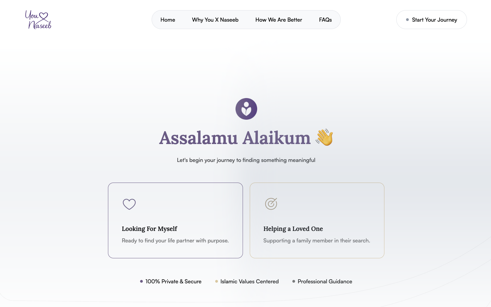

**Timeline:** 2 months  
**Role:** Frontend Engineer → Full Stack Implementation  
**Status:** Live in Production

---

## Project Overview

Built a modern dating platform featuring AI-powered conversational onboarding, replacing traditional forms with an intelligent chat assistant. The system processes user conversations, generates structured data, and automates application processing with PDF generation and email notifications.



---

## Tech Stack

### Frontend Layer

- **Next.js** - React framework for server-side rendering
- **React** - UI component library
- **Tailwind CSS** - Utility-first styling
- **Shadcn UI** - Pre-built component library

### CMS & Backend

- **Payload CMS** - Headless CMS with custom collections
- **Pages Collection** - Dynamic content management
- **Custom PDF Export** - Server-side document generation
- **Background Jobs/Cron** - Async task processing

### AI Processing

- **Together.ai** - AI inference platform
- **GPT OSS 120B** - Open-source language model
- **AI-SDK Integration** - Streamlined LLM interactions
- **Two-Step LLM Pipeline** - Optimized for reliability

### Storage & Assets

- **AWS S3** - Object storage for user uploads
- **IAM Configuration** - Secure access management
- **File Uploads** - Selfie storage and retrieval

### Email Delivery

- **AWS SES** - Production email service
- **Nodemailer** - Email transport layer
- **VDM Analytics** - Deliverability monitoring
- **Custom Templates** - Configurable via CMS

### Database

- **PostgreSQL** - Relational database
- **Railway Hosting** - Managed database service

### Infrastructure

- **Railway** - Application hosting and deployment
- **One.com** - Domain registration and DNS management

---

## Architecture Flow

### 1. User Journey

**User visits site** → Next.js renders pages from Payload CMS

### 2. Chat Initiation

**User starts chat** → Together.ai LLM asks questions in JSON format

### 3. File Upload

**User uploads selfie** → File stored in AWS S3

### 4. Chat Completion

**Chat completes (~100 messages)** → Background job queued in Payload

### 5. Data Extraction

**Job executes** → LLM extracts key-value pairs from conversation

### 6. Data Structuring

**Key-value pairs generated** → LLM converts to structured JSON dataset

### 7. Application Creation

**JSON dataset processed** → Application record created in Payload CMS

### 8. Notifications

**Application saved** → AWS SES sends emails to user and admins

### 9. Admin Review

**Admin views application** → Can download formatted PDF via custom button

---

## Technical Challenges & Solutions

### Challenge 1: File Storage Sync Issues

**Problem:** Payload CMS stores files locally by default. Files uploaded in local development didn't appear in production.

**Solution:** Integrated AWS S3 with IAM user configuration. All file uploads now route to S3, ensuring consistency across environments.

**Learning:** Spent time understanding AWS IAM permissions and S3 bucket policies.

---

### Challenge 2: LLM Output Reliability

**Problem:** Initial YAML output format failed consistently. LLMs couldn't generate valid YAML despite explicit instructions and formatting requirements.

**Solution:** Switched to JSON output format. Reduced failure rate but still encountered 70% failure when asking LLM to both extract information AND format it simultaneously.

**Final Solution:** Implemented two-step pipeline:

1. First call: Extract key-value pairs from conversation
2. Second call: Convert key-value pairs to JSON

**Result:** Failure rate dropped to near-zero. LLMs perform better with single-task instructions.

---

### Challenge 3: Background Processing

**Problem:** Processing ~100 messages with LLM calls takes significant time. Can't block user interface during processing.

**Solution:** Implemented background job system using Payload's built-in cron daemon. User sees thank you page immediately while processing happens asynchronously.

**Learning:** Spent 8 hours learning Node.js async patterns, daemon processes, and job queue management.

---

### Challenge 4: Email Delivery Infrastructure

**Problem:** Railway's Hobby plan blocks outbound SMTP. Managed email services (Resend, Mailgun, Sendgrid) cost $15-20/month.

**Solutions Evaluated:**

- Upgrade to Railway Pro: $20/month
- Resend: $20/month
- Mailgun: $15-20/month
- Sendgrid: $15-20/month

**Final Solution:** AWS SES

- Cost: Pennies per email (fraction of managed services)
- Required: DNS verification, production access request
- Result: Approved for production in <24 hours
- Implementation: Nodemailer transport with custom templates

---

### Challenge 5: PDF Generation

**Problem:** Client needed formatted PDF reports from structured application data.

**Solution:** Created custom Payload CMS element that appears before save actions. Clicking "Download PDF" generates human-friendly formatted document from application JSON.

**Implementation:** 2 hours of formatting and layout refinement.

---

## Key Technical Decisions

### Why Two-Step LLM Processing?

Single-step extraction and formatting failed 70% of the time. LLMs handle single-task instructions more reliably than multi-task prompts.

### Why JSON Over YAML?

Despite clear instructions and critical formatting tags, LLMs consistently produced invalid YAML. JSON proved significantly more reliable.

### Why AWS SES Over Managed Services?

Cost optimization. Managed services cost $15-20/month for features we didn't need. AWS SES costs pennies with same deliverability.

### Why Background Jobs?

Processing 100+ messages with multiple LLM calls takes 30-60 seconds. Background processing maintains smooth UX while handling heavy compute.

### Why S3 Integration?

Payload's local file storage breaks in multi-environment deployments. S3 provides consistent file access across development and production.

---

## Results

✅ Delivered on time within 2-month timeline  
✅ Successfully deployed full-stack application with AI integration  
✅ Implemented cost-effective infrastructure (avoided $20/month email costs)  
✅ Built reliable LLM pipeline with near-zero failure rate  
✅ Automated application processing with background jobs  
✅ Created admin-friendly PDF export system

---

## Skills Acquired

**Backend Development**

- Background job processing
- Cron daemon configuration
- Async task management

**Cloud Infrastructure**

- AWS S3 bucket management
- AWS IAM user configuration
- AWS SES email delivery
- DNS record management

**AI Integration**

- LLM prompt engineering
- Multi-step AI pipelines
- Output format optimization
- Error handling for AI responses

**DevOps**

- Multi-environment deployment
- Railway platform configuration
- Email service integration

---

## Tech Stack Summary

```
Frontend:     Next.js + React + Tailwind + Shadcn
CMS:          Payload CMS
Database:     PostgreSQL (Railway)
Storage:      AWS S3
Email:        AWS SES + Nodemailer
AI:           Together.ai GPT OSS 120B
Hosting:      Railway
Domain/DNS:   One.com
```

---

## Conclusion

This project pushed me outside my frontend comfort zone into full-stack territory. I navigated AWS services, implemented AI pipelines, built background job systems, and delivered a production-ready dating platform with conversational onboarding.

The most valuable lesson: complex problems often need simple solutions. When the LLM failed at multi-tasking, breaking it into sequential steps solved the issue. When email services were expensive, going lower-level with AWS SES cut costs by 95%.

Frontend engineers can absolutely ship full-stack projects. It just requires willingness to learn, systematic problem-solving, and not being afraid to dive into unfamiliar territory.
